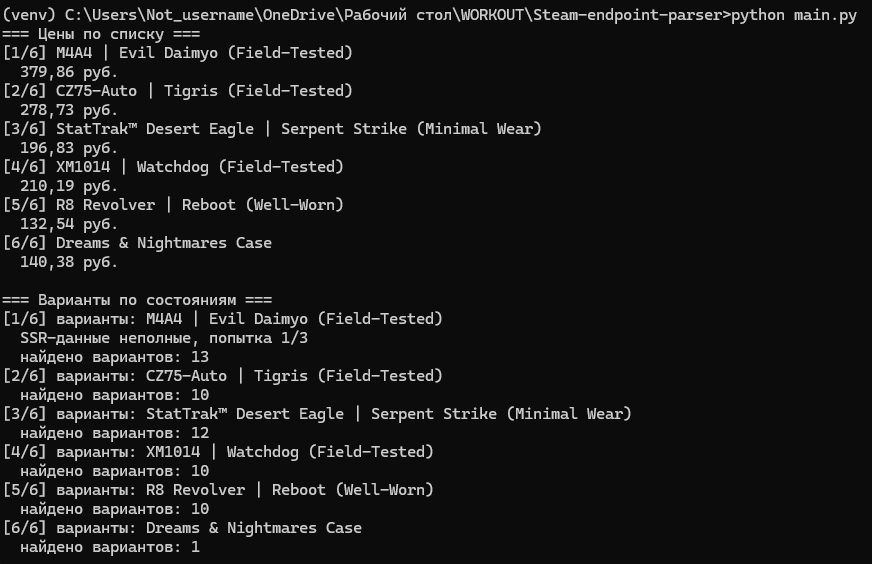
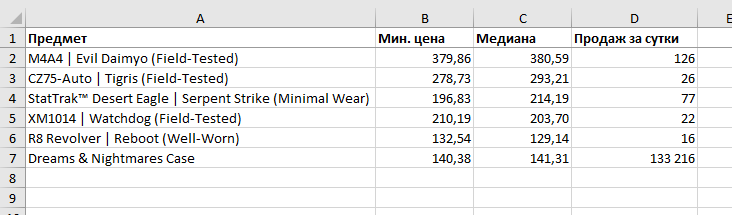
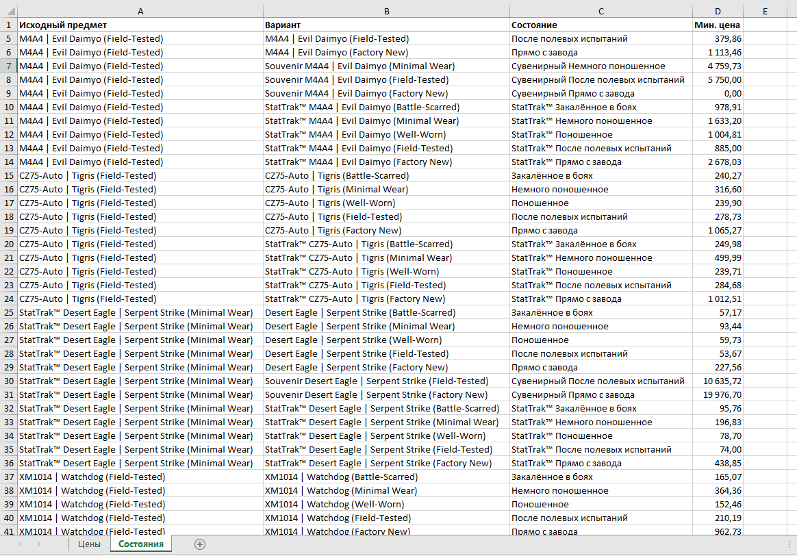

# Парсер цен Steam Community Market

Собирает цены предметов CS2 с торговой площадки Steam и выгружает их в Excel.

Данные берутся двумя разными способами:

- **JSON-эндпоинт** `priceoverview` — минимальная цена, медиана и число продаж за сутки по конкретному предмету
- **HTML-страница листинга** — цены по всем состояниям предмета сразу (Factory New, Field-Tested, StatTrak™, сувенирные), которых в JSON-эндпоинте нет

Второй способ понадобился потому, что через `priceoverview` пришлось бы делать отдельный запрос на каждое состояние — по 10–13 запросов вместо одного.

## Скриншоты

Работа скрипта:



Лист «Цены» — сводка по списку предметов:



Лист «Состояния» — разбивка по всем вариантам:



## Что умеет

- Читает список отслеживаемых предметов из `items.json`
- Соблюдает паузы между запросами, чтобы не упереться в лимит Steam
- При ответе `429 Too Many Requests` ждёт с увеличивающейся задержкой и повторяет запрос
- Приводит цены и объёмы продаж к числам, а не строкам
- Выгружает результат в Excel: два листа, закреплённые заголовки, числовые форматы
- Имя файла содержит дату и время — прошлые выгрузки не затираются

## Технические решения

**Разные разделители в одном ответе.** Steam возвращает цену как `379,86 руб.` (запятая — десятичный разделитель), а объём продаж как `133,216` (запятая — разделитель тысяч). Одинаковый символ означает противоположное, поэтому в `parsers.py` две отдельные функции: `parse_price` и `parse_volume`. При обработке одной универсальной функцией объём в 133 тысячи превратился бы в 133.

**Неразрывный пробел.** В больших числах Steam разделяет разряды символом `\xa0`, а не обычным пробелом. Обычный `.replace(" ", "")` его не убирает.

**Разбор JSON внутри HTML.** Страница листинга собрана на фреймворке с server-side rendering: готовой вёрстки с ценами в HTML нет, все данные лежат в `window.SSR.loaderData` — JSON внутри тега `<script>`, причём вложенный (строки внутри массива сами являются JSON).

Для его выделения используется `json.JSONDecoder().raw_decode()`, а не регулярное выражение: декодер считает вложенные скобки и корректно определяет конец структуры, тогда как регулярка на вложенных данных обрывается в произвольном месте.

**Нестабильность источника.** Steam отдаёт полный SSR-пакет не при каждом запросе — на один и тот же URL иногда приходит урезанная версия без нужных данных. Поэтому `get_variants` делает несколько попыток с паузой, а нужный блок ищется перебором по содержимому, а не по фиксированному индексу в массиве.

**Мягкая деградация.** Недоступность одного предмета не прерывает сбор: функции возвращают `None`, в отчёт попадает строка с пустыми значениями, остальные предметы обрабатываются дальше.

## Стек

- **Python 3.12**
- **requests** — HTTP-запросы с таймаутами и обработкой кодов ответа
- **BeautifulSoup4 + lxml** — разбор HTML
- **openpyxl** — генерация Excel

## Структура

```
main.py             — точка входа, сбор данных и запуск выгрузки
price_fetcher.py    — запросы к JSON-эндпоинту, обработка лимитов
listing_parser.py   — разбор HTML-страницы листинга
parsers.py          — преобразование строк Steam в числа
exporter.py         — формирование Excel-файла
items.json          — список отслеживаемых предметов
```

## Запуск

```bash
git clone https://github.com/agladcenko/Steam-endpoint-parser.git
cd Steam-endpoint-parser
python -m venv venv
venv\Scripts\activate        # Windows
source venv/bin/activate     # Linux/macOS
pip install -r requirements.txt
python main.py
```

Список отслеживаемых предметов задаётся в `items.json` — названия должны точно совпадать с `market_hash_name` на площадке:

```json
[
  "M4A4 | Evil Daimyo (Field-Tested)",
  "Dreams & Nightmares Case"
]
```

Файл сохраняется в UTF-8, иначе символ `™` в названиях StatTrak-предметов не будет распознан.

## Ограничения

- Steam ограничивает частоту запросов. Паузы в коде подобраны опытным путём; при большом списке предметов сбор занимает заметное время.
- При работе через VPN лимит срабатывает чаще: адрес общий, и его исчерпывают другие пользователи.
- Структура SSR-данных не документирована и может измениться при обновлении площадки. В этом случае разбор HTML-части перестанет работать — скрипт сообщит об этом и продолжит сбор основных цен.
